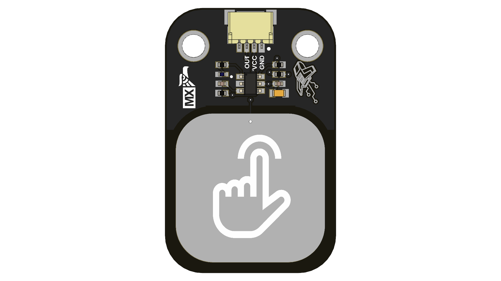

# Touch Capacitive Sensor

The **UNIT Touch Capacitive Sensor** is a compact breakout module utilizing the TTP223 capacitive touch IC. It enables microcontrollers to detect touch input without mechanical buttons or moving components. The module operates by simply supplying power and connecting the output pin to a digital input on your development board, providing a reliable and straightforward touch interface.

  
  
<em></em>

## 📦 Overview

| Feature                 | Description                                                   |
|------------------------|---------------------------------------------------------------|

## 🧪 Use Cases

- Touch-sensitive controls for user interfaces
- Proximity sensing for devices

## 📚 Resources

- [Schematic Diagram](hardware/schematic.pdf)
- [Board Dimensions (DXF)](docs/dimensions.dxf)
- [Pinout Diagram](docs/pinout.png)
- [Firmware Examples](firmware/)
- [Getting Started Guide](docs/getting_started.md)

## 📝 License

All hardware and documentation in this project are licensed under the **MIT License**.  
Please refer to [`LICENSE.md`](LICENSE.md) for full terms.

  Template created by UNIT Electronics 

