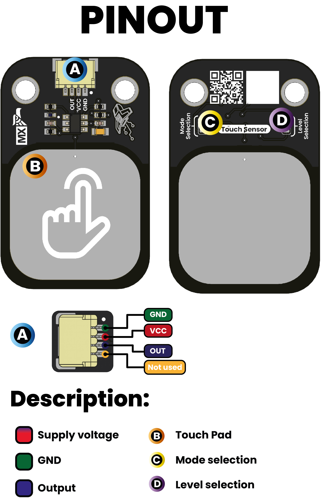

# Hardware

    <a href="./unit_sch_V_0_0_1_ue0099_Sensor_Touch.pdf">
          Schematics
    </a>

## 🔌 Pinout

### **Pinout Diagram**

    <a href="./unit_sch_V_0_0_1_ue0099_Sensor_Touch.pdf">
          Schematics
    </a>

 
 

### **Pinout Details**

| Pin Label | Function     | Notes                           |
|-----------|--------------|---------------------------------|
| VCC       | Power Supply | 3.3V or 5V, depending on design  |
| GND       | Ground       | Common ground reference         |
| DOUT        | Data Signal  | Digital Output signal     |
| Mode Select | Solder Jumper | Select between Momentary or Toggle mode |
| Level Selection| Solder Jumper | Select between low and high sensitivity |

#### Mode & Level Selection

| Mode | Level | TOG | AHLB | Pad Q (CMOS)         | Pad OPDO (Open Drain)    | Behavior                        |
|------|-------|-----|------|----------------------|--------------------------|----------------------------------|
| 0    | 0     | 0   | 0    | Active high          | Open drain, active high  | Momentary, single pulse          |
| 0    | 1     | 0   | 1    | Active low           | Open drain, active low   | Momentary, inverted pulse        |
| 1    | 0     | 1   | 0    | Toggle, power-on=0   | Toggle, active high      | Toggle, touch to change state    |
| 1    | 1     | 1   | 1    | Toggle, power-on=1   | Toggle, active low       | Toggle, inverted                 |

*Mode and level solder jumpers set output type and behavior (momentary/toggle, active high/low).*

## 📏 Dimensions

<a href="./resources/unit_dimension_V_0_0_1_ue0099_Sensor_Touch.png">  Dimensions</a>

## 📃 Topology

<a href="./resources/unit_topology_V_0_0_1_ue0099_Sensor_Touch.png">  Topology</a>
 
 

| Ref. | Description                              |
|------|------------------------------------------|
| SW1  | Capacitive Touch Button                  |
| L1   | Built-In LED                             |
| IC1  | TTP223-BA6-TD Touch Detector             | 
| J1   | QWIIC Connector (JST 1 mm pitch) for I2C |
| SB1  | Solder Bridge for Mode Selection         | 
| SB2  | Solder Bridge for Logic Level Selector   |

