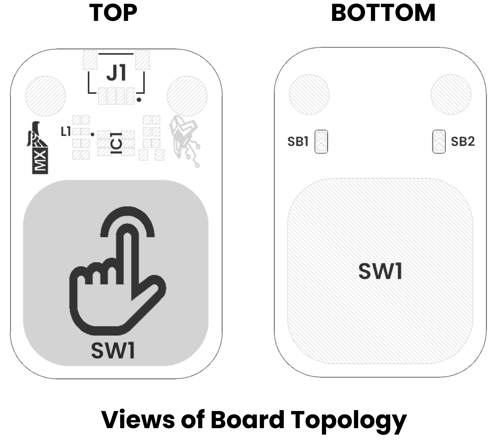

# Hardware

    <a href="./unit_sch_V_0_0_1_ue0099_Sensor_Touch.pdf">
          Schematics
    </a>

---

## ⚙️ Technical Specifications

## 🔌 Pinout

**Pinout Diagram**

**Pinout Details**

| Pin Label | Function     | Notes                           |
|-----------|--------------|---------------------------------|
| VCC       | Power Supply | 3.3V or 5V, depending on design  |
| GND       | Ground       | Common ground reference         |
| D0        | Data Signal  | Digital input/output signal     |

## 📏 Dimensions

<a href="./resources/unit_dimension_V_0_0_1_ue0099_Sensor_Touch.png">  Dimensions</a>

## 📃 Topology

<a href="./resources/unit_topology_V_0_0_1_ue0099_Sensor_Touch.png">  Topology</a>

| Ref. | Description                              |
|------|------------------------------------------|
| SW1  | Capacitive Touch Button                  |
| L1   | Built-In LED                             |
| IC1  | TTP223-BA6-TD Touch Detector             | 
| J1   | QWIIC Connector (JST 1 mm pitch) for I2C |
| SB1  | Solder Bridge for Mode Selection         | 
| SB2  | Solder Bridge for Logic Level Selector   |

