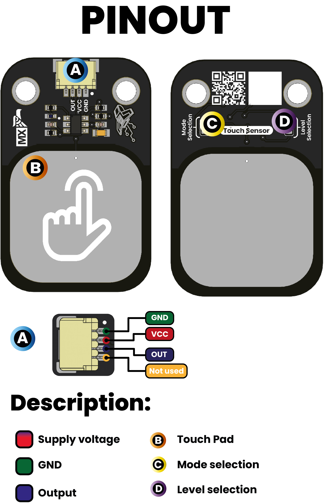

# 🔌 Pinout

### **Pinout Diagram**

    <a href="../resources/unit_sch_V_0_0_1_ue0099_Sensor_Touch.pdf">
          Schematics
    </a>

 
 

### **Pinout Details**

| Pin Label | Function     | Notes                           |
|-----------|--------------|---------------------------------|
| VCC       | Power Supply | 3.3V or 5V, depending on design  |
| GND       | Ground       | Common ground reference         |
| DOUT        | Data Signal  | Digital Output signal     |
| Mode Select | Solder Jumper | Select between Momentary or Toggle mode |
| Level Selection| Solder Jumper | Select between low and high sensitivity |

| Mode Selection | Level Selection | Description                              |
|----------------|-----------------|------------------------------------------|
| 0              | 0               | Single pulse, momentary                  |
| 0              | 1               | Single pulse, toggle (inverted pulse)    |
| 1              | 0               | Pulse latch, requires another touch to release |
| 1              | 1               | Pulse latch, requires another touch to release (inverted) |